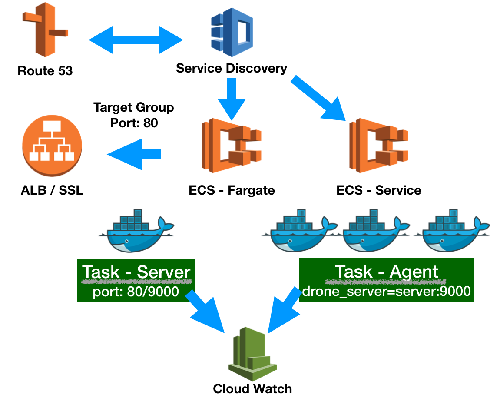

# drone-terraform



[Drone](https://github.com/drone/drone) CI/CD infrastructure using [Terraform][3] in [AWS](https://aws.amazon.com).

## Requirement

AWS Fargate with Amazon ECS is currently only available in the following regions:


| Region Name | Region | 
| --- | --- | 
| US East \(N\. Virginia\) | us\-east\-1 | 
| US East \(Ohio\) | us\-east\-2 | 
| US West \(Oregon\) | us\-west\-2 | 
| EU \(Ireland\) | eu\-west\-1 | 
| EU \(London\) | eu\-west\-2 | 
| EU \(Frankfurt\) | eu\-central\-1 | 
| Asia Pacific \(Tokyo\) | ap\-northeast\-1 | 
| Asia Pacific \(Singapore\) | ap\-southeast\-1 | 
| Asia Pacific \(Sydney\) | ap\-southeast\-2 | 

See [AWS Fargate on Amazon ECS][1] to get more detail information. Service discovery is available in the following AWS Regions:

| Region Name | Region | 
| --- | --- | 
| US East \(N\. Virginia\) | us\-east\-1 | 
| US East \(Ohio\) | us\-east\-2 | 
| US West \(N\. California\) | us\-west\-1 | 
| US West \(Oregon\) | us\-west\-2 | 
| Asia Pacific \(Mumbai\) | ap\-south\-1 | 
| Asia Pacific \(Seoul\) | ap\-northeast\-2 | 
| Asia Pacific \(Singapore\) | ap\-southeast\-1 | 
| Asia Pacific \(Sydney\) | ap\-southeast\-2 | 
| Asia Pacific \(Tokyo\) | ap\-northeast\-1 | 
| EU \(Frankfurt\) | eu\-central\-1 | 
| EU \(Ireland\) | eu\-west\-1 | 
| EU \(London\) | eu\-west\-2 | 
| EU \(Paris\) | eu\-west\-3 | 
| South America \(São Paulo\) | sa\-east\-1 | 
| Canada \(Central\) | ca\-central\-1 | 

See [AWS Service Discovery][2] to get more detail information. Before you begin, make sure you've read the limition.

[1]:https://docs.aws.amazon.com/AmazonECS/latest/developerguide/AWS_Fargate.html
[2]:https://docs.aws.amazon.com/AmazonECS/latest/developerguide/service-discovery.html
[3]:https://www.terraform.io/

## Configuration

create new file with `terraform.tfvars` filename and put the following variable:

```
aws_access_key = "xxx"
aws_secret_key = "xxx"
drone_github_client = "xxxx"
drone_github_secret = "xxxx"
ssh_public_key = "ssh-rsa xxxxxx appleboy@xxxx"
```

## Build Infrastructure


The first command to run for a new configuration

```
$ terraform init
Initializing the backend...
Initializing provider plugins...
- downloading plugin for provider "aws"...
```

Apply Changes

```
$ terraform apply
```

You will see the output:

```
Outputs:

alb_hostname = http://drone-front-alb-xxxxxxx.us-east-1.elb.amazonaws.com
database_root_password = <sensitive>
region = us-east-1
```

## How to testing

```sh
$ go test -timeout 30m -v .
```
